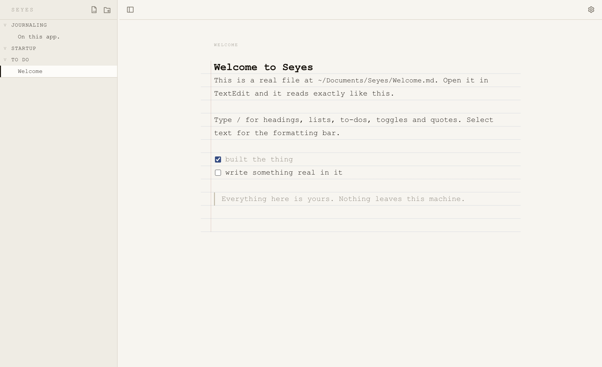
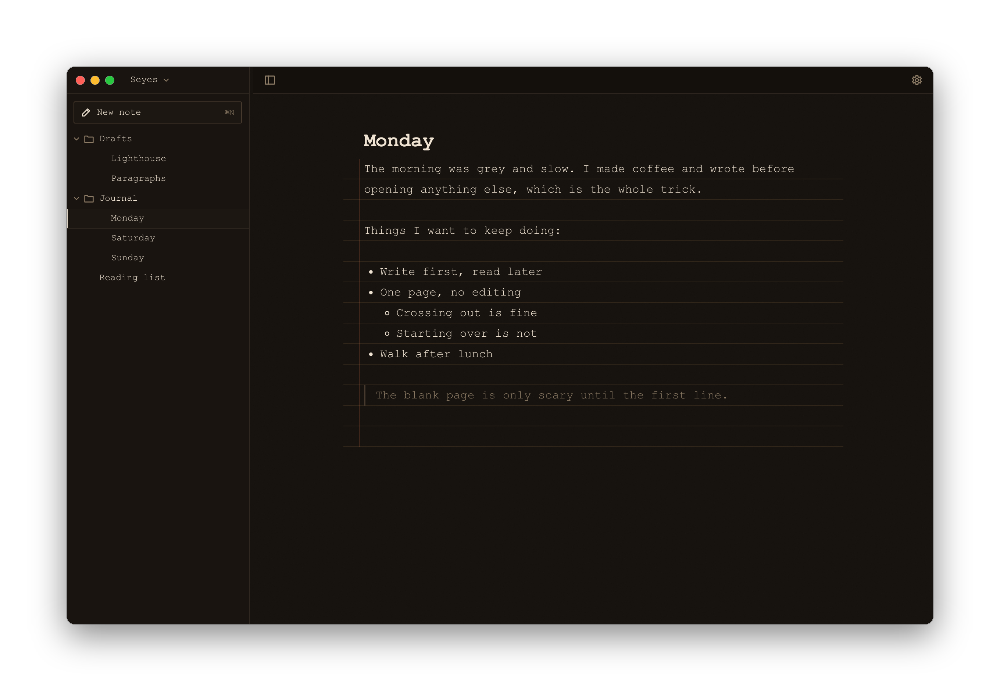

# Seyes

A small writing app that keeps your writing in plain files on your own computer.

```
npx seyes-app
```

Or install it once and get a real Mac app in your Dock. See
[Get it as a Mac app](#get-it-as-a-mac-app).



<details>
<summary>Dark</summary>



</details>

---

## Why this exists

I write in paper journals and I love it. I also wanted to write on my computer,
and I never found something I actually liked. The options were always ugly, or
behind a subscription, or so full of features that opening them felt like work.
Mostly I disliked that my writing ended up somewhere I did not control, in a
format I could not read without the app that made it.

So this is an interface over a folder. That is the whole idea.

Every note is a `.md` file sitting in a normal folder on your machine. You can
open them in TextEdit, grep them, back them up, put them in Git, sync them with
iCloud, or move them somewhere else entirely and never open Seyes again. The
app is a window onto that folder, not a place your writing goes to live.

The name comes from Séyès, the ruled paper French schoolchildren write on. If
you turn on ruled paper in the settings, you will see why.

## What it is like to use

You type. There are no modes, no preview pane, no toggle between editing and
reading.

Press `/` for headings, lists, to-dos, toggles, quotes and code. Select any text
and a small bar appears, or use `⌘B`, `⌘I`, `⌘U`. If you already know markdown,
typing `# ` or `- ` works too. If you do not, you will never find out that it
does, and nothing is worse for it.

`⌘K` searches everything you have written. `⌘\` hides the sidebar.

The settings gear, top right, holds the three fonts (Courier, Verdana, Georgia),
light and dark, the ruled paper toggle, and the exact path of whatever note you
have open, with a button to reveal it in Finder.

## What happens to your files

Notes are markdown, and Seyes tries hard not to leave fingerprints on them.
There is no frontmatter, no ids, no metadata of any kind written into your
files. Your font choice and window state live in `~/.config/seyes`, not in your
writing.

Markdown cannot express underline, highlight or collapsible sections, so those
three save as `<u>`, `<mark>` and `<details>`. All valid HTML, all readable, all
understood by most other editors.

Everything round-trips exactly. There is a test that opens a file, saves it ten
times in a row, and fails if a single character moved. This matters more than it
sounds: a serializer that adds one blank line per save looks fine once and ruins
a file over a month.

Deleting a note moves it to the system Trash. It is never unlinked outright.

Because the folder is the source of truth, Seyes watches it. Rename a file in
Finder, edit a note in another app, drop a folder in, let iCloud sync something
from another machine: it shows up straight away, without a reload. If the note
you have open changes on disk, it updates itself, unless you are mid-sentence in
it, in which case your typing wins.

## About privacy

There is no account, no database, no analytics, and no network call. The server
binds to `127.0.0.1` only, so nothing on your network can reach it. Next.js
build telemetry is switched off.

This is not a promise about a privacy policy. It is just that there is nowhere
for the data to go.

## Running it

```
npx seyes-app
```

The first run asks one question, where your writing should live, defaulting to
`~/Documents/Seyes`. Then it builds itself once, which takes under a minute, and
opens your browser. Nothing else to configure.

One thing worth knowing if you are on a Mac: if you have iCloud's "Desktop &
Documents Folders" switched on, then `~/Documents` is inside iCloud Drive, and
so is that default. That is fine if you want your writing synced, and not fine
if you thought it was staying on this machine. Pick a folder outside `~/Desktop`
and `~/Documents` if you want it local, for instance `~/Seyes`. You can change
it later from the settings gear.

Running it every day is nicer as an installed command than through `npx`, which
re-downloads and rebuilds whenever you invoke it slightly differently:

```
npm i -g seyes-app
seyes
```

## Get it as a Mac app

An icon in your Dock, no terminal, ⌘Q to quit:

```
npm i -g seyes-app
bash "$(npm root -g)/seyes-app/mac/build.sh"
```

That puts `Seyes.app` in `/Applications`. Double-click it, or ⌘Space and type
"seyes". It needs the Xcode command line tools (`xcode-select --install`), which
is the only extra thing to install, and it takes a few seconds.

The app is a wrapper, not a copy. It finds the `seyes` command, starts the
server, shows the page in its own window, and stops the server again when you
quit. Upgrading is `npm i -g seyes-app`; the app itself never needs rebuilding.

Because the page runs edge to edge under a transparent titlebar, the window is
dragged by the app's own top bar rather than a titlebar strip. Grab it anywhere
that is not a button.

To work on Seyes itself:

```
git clone https://github.com/oscomarch/seyes.git
cd seyes
npm install
npm run dev
```

`npm test` runs the suite. The tests worth knowing about are the markdown
round-trip ones in `tests/markdown.test.ts` and the path-containment ones in
`tests/paths.test.ts`, which check that no request can read or write outside
your writing folder.

## How it is put together

```
src/lib/fs        reading and writing files, safely
src/lib/editor    the editor, and markdown in and out of it
src/app/api       a thin HTTP layer over the above
src/components    sidebar, editor, desk, settings
bin/seyes.mjs     the launcher you get from npx
mac/              the Mac app wrapper, and the script that builds it
```

The filesystem layer knows nothing about markdown, and the editor layer knows
nothing about files. Everything the server does with a path goes through one
function that refuses to leave your folder.

## Honest limitations

It is early. Some things are rough:

- No images, tables or coloured text
- It has only really been used on macOS
- The Mac app is unsigned, so it is built on your machine rather than downloaded

## License

MIT. Do what you like with it.
