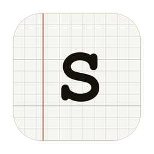
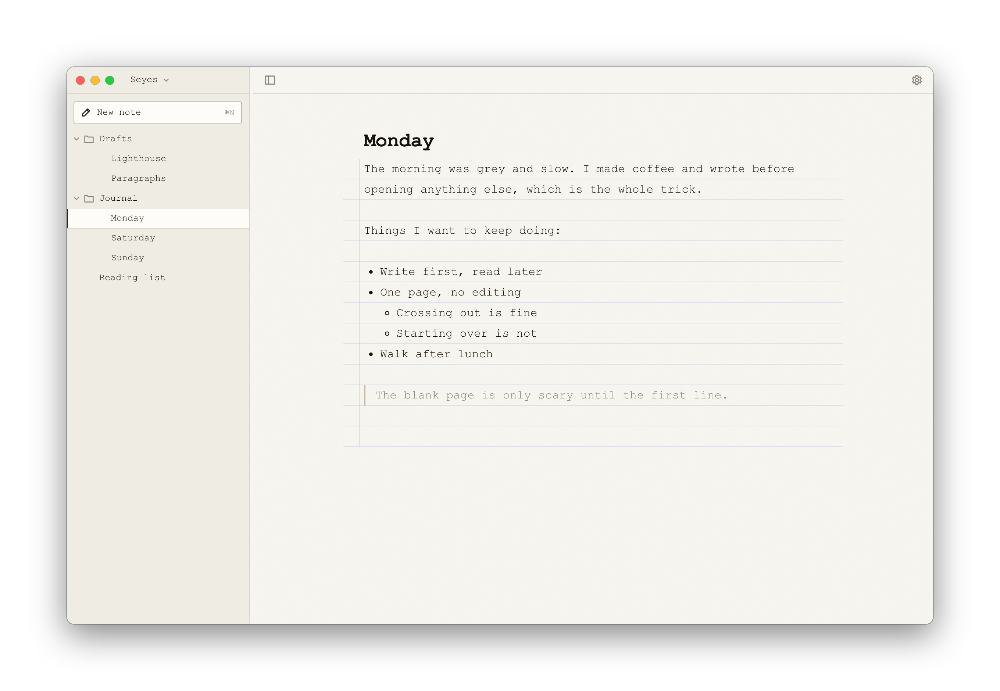

<p align="center">
  
</p>

<h1 align="center">Seyes</h1>

<p align="center">
  A small writing app for the Mac.<br>
  Your writing stays in plain files on your own computer.
</p>

<p align="center">
  <a href="https://oscomarch.github.io/seyes/"><b>Download for Mac</b></a>
  &nbsp;·&nbsp;
  <a href="#run-it-from-a-terminal">Run it from a terminal</a>
  &nbsp;·&nbsp;
  <a href="https://github.com/oscomarch/seyes/releases">Releases</a>
</p>

<p align="center">
  
</p>

## Why I made it

I keep paper journals and I love them. I wanted to write on my computer too,
but I never found an app I liked. They were ugly, or they wanted a
subscription, or they had so many features that opening one felt like work.
What bothered me most was that my writing ended up somewhere I didn't control,
in a format I couldn't read without the app.

So Seyes is just a window onto a folder.

Every note is a `.md` file in a normal folder. You can open it in TextEdit,
search it with grep, back it up or put it in Git. If you stop using Seyes
tomorrow, your writing is still there.

The name comes from Séyès, the ruled paper French kids learn to write on. Turn
on ruled paper in the settings and you'll see why.

## Getting it

[Download Seyes for Mac](https://oscomarch.github.io/seyes/). It's free, about
70 MB, and runs on macOS 13 or later, on Apple Silicon and Intel. Open the
`.dmg` and drag Seyes into Applications.

Seyes isn't signed by Apple yet, so macOS stops it the first time you open it.
Click **Done** when it says "Seyes" Not Opened. Don't click Move to Trash. Then
open System Settings, go to Privacy & Security, scroll down and click **Open
Anyway**. You only do this once. The [download page](https://oscomarch.github.io/seyes/#install)
shows each step with pictures.

The first time Seyes opens, it asks where your writing should live. It suggests
`~/Seyes`, a folder that stays on your Mac.

## Writing

You just type. There are no modes and no preview pane.

| | |
|---|---|
| `/` | Add a heading, a list, a to-do, a toggle, a quote or some code |
| `Tab` | Turn a line into a bullet, then indent it. `Shift Tab` takes it back |
| `⌘B` `⌘I` `⌘U` | Bold, italic, underline. Or select text for a small toolbar |
| `⌘N` | New note, in the folder you're in |
| `⌘K` | Search everything you've written |
| `⌘\` | Hide the sidebar |

If you know markdown, typing `# ` or `- ` does what you'd expect. If you don't,
you never need to.

The gear in the top right holds the settings. You can pick a font (Courier,
Verdana or Georgia), switch between light and dark, and turn the ruled paper on
or off. It also shows where the open note lives on disk.

## Your folder

The folder's name sits at the top of the sidebar. Click it to see where your
writing lives and whether it stays on this Mac or syncs with iCloud. From there
you can show it in Finder, move the whole folder somewhere else, open a
different folder, or jump back to one you used before.

Right-click any note or folder to rename it, move it to the Trash, or show it
in Finder. Drag notes onto folders to file them.

Moving your writing into an iCloud folder asks first. On a Mac with "Desktop &
Documents Folders" turned on, `~/Documents` is in iCloud Drive, and plenty of
people don't know that.

## Your files

Seyes tries not to leave marks on your notes. It writes no frontmatter, no ids
and no hidden metadata. Settings like your font are kept in `~/.config/seyes`,
away from your writing.

Markdown has no way to write underline, highlight or a collapsible section. So
those three are saved as `<u>`, `<mark>` and `<details>`. That's plain HTML,
and most editors read it fine.

A file should come back exactly as it went in. There's a test that opens a
note, saves it ten times, and fails if a single character moved. It sounds
small. But an editor that adds one blank line on every save looks fine at first
and wrecks a file over a month.

When you delete a note it goes to the Trash. Nothing is ever deleted for good.

Seyes watches the folder, so changes from outside show up right away. Rename a
file in Finder or edit a note in another app and you'll see it without
reloading. If the note you have open changes on disk, it updates. The one
exception is when you're typing in it. Then your typing wins.

## Privacy

There's no account, no database and no analytics. Seyes only goes online when
you choose Check for Updates in the Seyes menu, and then it asks GitHub for the
latest version and nothing else.

The app runs a small server on `127.0.0.1`, so nothing else on your network can
reach it. Each time the app starts, it makes a new secret key that only its own
window gets. Other programs on your Mac can't use that server to read your
writing.

I'm not asking you to trust a privacy policy. There's just nowhere for your
data to go.

## Run it from a terminal

If you have Node installed, you can skip the download and run Seyes in your
browser.

```
npx seyes-app
```

The first time, it asks where your writing should go, then builds itself once,
which takes under a minute. If you use it every day, install it instead, since
`npx` can rebuild it whenever you type the command a little differently.

```
npm i -g seyes-app
seyes
```

## Working on Seyes

```
git clone https://github.com/oscomarch/seyes.git
cd seyes
npm install
npm run dev
```

`npm test` runs the tests. The ones worth knowing about are the markdown
round-trip tests in `tests/markdown.test.ts` and the path tests in
`tests/paths.test.ts`, which make sure no request can read or write outside
your writing folder.

`mac/release.sh` builds the downloadable app into `dist/`. It fetches the
official Node runtime, checks it against the checksums nodejs.org publishes,
builds the server ahead of time, and wraps it all in `Seyes.app` inside a
`.dmg`.

## How it's built

```
src/lib/fs        reading and writing files, safely
src/lib/editor    the editor, and markdown in and out of it
src/app/api       a thin HTTP layer over the above
src/components    sidebar, editor, desk, settings
src/proxy.ts      the per-launch key that keeps other programs out
bin/seyes.mjs     the launcher you get from npx
mac/              the native Mac window, and the scripts that build it
docs/             the download page
```

The file code doesn't know anything about markdown. The editor doesn't know
anything about files. Every path the server touches goes through one function,
and that function won't leave your folder.

The Mac app is a small Swift window around a web view. It starts the server it
carries inside itself, shows it, and stops it when you quit.

## Limitations

It's early, and some things are rough. There are no images, tables or colored
text yet. It only runs on the Mac. The app isn't signed by Apple, so macOS asks
you to confirm it once, and again for each new version.

## License

MIT. Do what you like with it.
